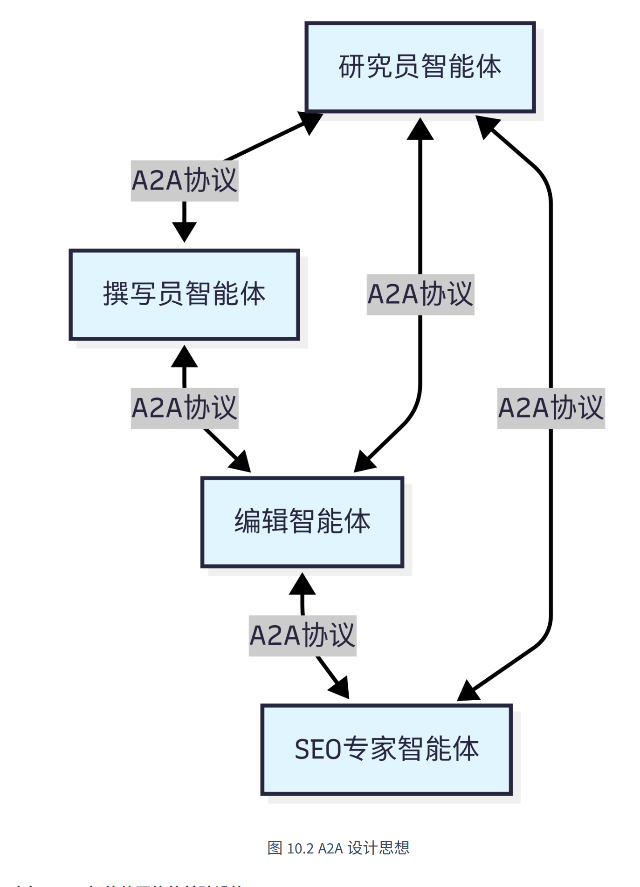
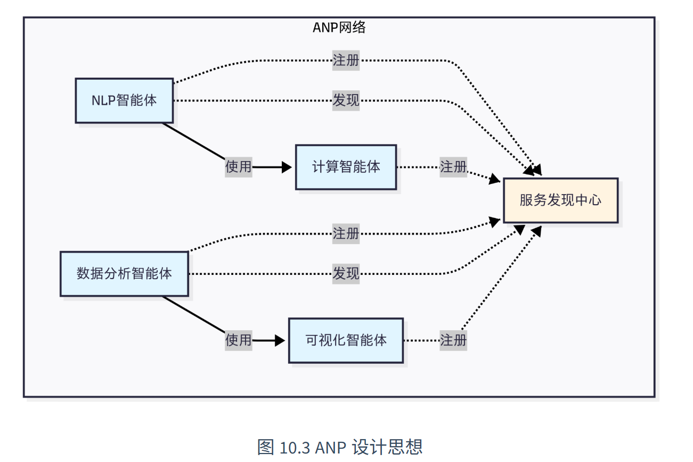
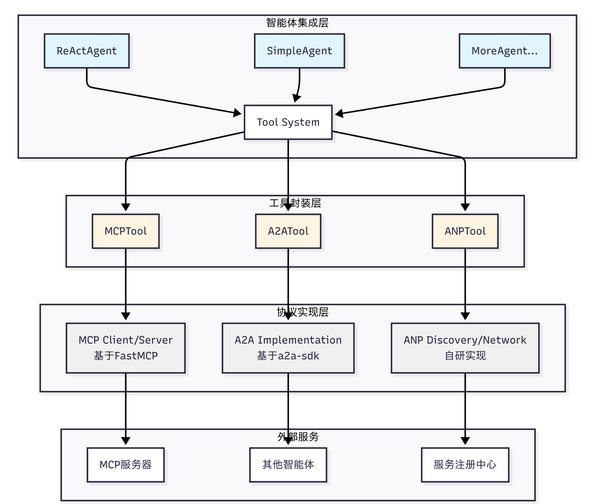

# 智能体通信协议

在前面的章节中，我们构建了功能完备的单体智能体，它们具备推理、工具调用和记忆能力。然而，当我们尝试构建更复杂的 AI 系统时，自然会有疑问：**如何让智能体与外部世界高效交互？如何让多个智能体相互协作？**

这正是智能体通信协议要解决的核心问题。本章将为 HelloAgents 框架引入三种通信协议：

- **MCP**（Model Context Protocol）：用于智能体与工具的标准化通信
- **A2A**（Agent-to-Agent Protocol）：用于智能体间的点对点协作
- **ANP**（Agent Network Protocol）：用于构建大规模智能体网络

这三种协议共同构成了智能体通信的基础设施层。

## 智能体通信协议基础

### 为何需要通信协议

回顾先前构建的 ReAct 智能体，它已经具备了强大的推理和工具调用能力。让我们看一个典型的使用场景：

```python
from hello_agents import ReActAgent, HelloAgentsLLM
from hello_agents.tools import CalculatorTool, SearchTool

llm = HelloAgentsLLM()
agent = ReActAgent(name="AI助手", llm=llm)
agent.add_tool(CalculatorTool())
agent.add_tool(SearchTool())

# 智能体可以独立完成任务
response = agent.run("搜索最新的AI新闻，并计算相关公司的市值总和")

```

这个智能体工作得很好，但它面临着三个根本性的限制：

1. **工具集成的困境**：每当需要访问新的外部服务（如 GitHub API、数据库、文件系统），我们都必须编写专门的 Tool 类。这不仅工作量大，而且不同开发者编写的工具无法互相兼容。

2. **能力扩展的瓶颈**：智能体的能力被限制在预先定义的工具集内，无法动态发现和使用新的服务。

3. **协作的缺失**：当任务复杂到需要多个专业智能体协作时（如研究员 + 撰写员 + 编辑），我们只能通过手动编排来协调它们的工作。

让我们通过一个更具体的例子来理解这些限制。假设你要构建一个智能研究助手，它需要：

```python
# 传统方式：手动集成每个服务
class GitHubTool(BaseTool):
    """需要手写GitHub API适配器"""
    def run(self, repo_url):
        # 大量的API调用代码...
        pass

class DatabaseTool(BaseTool):
    """需要手写数据库适配器"""
    def run(self, query):
        # 数据库连接和查询代码...
        pass

class WeatherTool(BaseTool):
    """需要手写天气API适配器"""
    def run(self, location):
        # 天气API调用代码...
        pass

# 每个新服务都需要重复这个过程
agent.add_tool(GitHubTool())
agent.add_tool(DatabaseTool())
agent.add_tool(WeatherTool())

```

这种方式存在明显的问题：

- **代码重复**：每个工具都要处理 HTTP 请求、错误处理、认证等
- **难以维护**：API 变更需要修改所有相关工具
- **无法复用**：其他开发者的工具无法直接使用
- **扩展性差**：添加新服务需要大量编码工作

通信协议的核心价值正是解决这些问题。它提供了一套标准化的接口规范，让智能体能够以统一的方式访问各种外部服务，而无需为每个服务编写专门的适配器。这就像互联网的 TCP/IP 协议，它让不同的设备能够相互通信，而不需要为每种设备编写专门的通信代码。

```python
from hello_agents.tools import MCPTool

# 连接到MCP服务器，自动获得所有工具
mcp_tool = MCPTool()  # 内置服务器提供基础工具

# 或者连接到专业的MCP服务器
github_mcp = MCPTool(server_command=["npx", "-y", "@modelcontextprotocol/server-github"])
database_mcp = MCPTool(server_command=["python", "database_mcp_server.py"])

# 智能体自动获得所有能力，无需手写适配器
agent.add_tool(mcp_tool)
agent.add_tool(github_mcp)
agent.add_tool(database_mcp)

```

通信协议带来的改变是根本性的：

- **标准化接口**：让不同服务提供统一的访问方式
- **互操作性**：使得不同开发者的工具可以无缝集成
- **动态发现**：允许智能体在运行时发现新的服务和能力
- **可扩展性**：让系统能够轻松添加新的功能模块

### 三种协议设计理念比较

智能体通信协议并非单一的解决方案，而是针对不同通信场景设计的一系列标准。在本章以目前业界主流的三种协议 MCP、A2A 和 ANP 为例进行实践，下面是一个总览的比较。

#### MCP：智能体与工具的桥梁

MCP（Model Context Protocol）由 Anthropic 团队提出，其核心设计理念是标准化智能体与外部工具/资源的通信方式。想象一下，你的智能体需要访问文件系统、数据库、GitHub、Slack 等各种服务。传统做法是为每个服务编写专门的适配器，这不仅工作量大，而且难以维护。MCP 通过定义统一的协议规范，让所有服务都能以相同的方式被访问。

MCP 的设计哲学是**"上下文共享"**。它不仅仅是一个 RPC（远程过程调用）协议，更重要的是它允许智能体和工具之间共享丰富的上下文信息。

如下图所示：

<div align="center">
  
</div>

当智能体访问一个代码仓库时，MCP 服务器不仅能提供文件内容，还能提供代码结构、依赖关系、提交历史等上下文信息，让智能体能够做出更智能的决策。


#### A2A：智能体间的对话

A2A（Agent-to-Agent Protocol）协议由 Google 团队提出，其核心设计理念是实现智能体之间的点对点通信。与 MCP 关注智能体与工具的通信不同，A2A 关注的是智能体之间如何相互协作。这种设计让智能体能够像人类团队一样进行对话、协商和协作。

A2A 的设计哲学是**"对等通信"**。

如下图所示：

<div align="center">
  
</div>

在 A2A 网络中，每个智能体既是服务提供者，也是服务消费者。智能体可以主动发起请求，也可以响应其他智能体的请求。这种对等的设计避免了中心化协调器的瓶颈，让智能体网络更加灵活和可扩展。

#### ANP：智能体网络的基础设施

ANP（Agent Network Protocol）是一个概念性的协议框架，目前由开源社区维护，还没有成熟的生态，其核心设计理念是构建大规模智能体网络的基础设施。

如果说：
- **MCP** 解决的是"如何访问工具"
- **A2A** 解决的是"如何与其他智能体对话"
- **ANP** 解决的是"如何在大规模网络中发现和连接智能体"

ANP 的设计哲学是**"去中心化服务发现"**。在一个包含成百上千个智能体的网络中，如何让智能体能够找到它需要的服务？

如下图所示，ANP 提供了服务注册、发现和路由机制，让智能体能够动态地发现网络中的其他服务，而不需要预先配置所有的连接关系：

<div align="center">
  
</div>

> **💡 如何选择合适的协议？**
>
> 目前的协议还处于发展早期，MCP 的生态相对成熟，不过各种工具的时效性取决于维护者，更推荐选择大公司背书的 MCP 工具。
>
> 选择协议的关键在于理解你的需求：
>
> - 如果你的智能体需要访问外部服务（文件、数据库、API），选择 **MCP**
> - 如果你需要多个智能体相互协作完成任务，选择 **A2A**
> - 如果你要构建大规模的智能体生态系统，考虑 **ANP**


### 通信协议架构设计

如下图所示，Agents 的通信协议架构采用三层设计，从底层到上层分别是：**协议实现层**、**工具封装层**和**智能体集成层**：

<div align="center">
  
</div>

**1. 协议实现层**

这一层包含了三种协议的具体实现。MCP 基于 FastMCP 库实现，提供客户端和服务器功能；A2A 基于 Google 官方的 a2a-sdk 实现；ANP 是我们自研的轻量级实现，提供服务发现和网络管理功能，当然目前也有官方的实现，考虑到后期的迭代，因此这里只做概念的模拟。

**2. 工具封装层**

这一层将协议实现封装成统一的 Tool 接口。`MCPTool`、`A2ATool` 和 `ANPTool` 都继承自 `BaseTool`，提供一致的 `run()` 方法。这种设计让智能体能够以相同的方式使用不同的协议。

**3. 智能体集成层**

这一层是智能体与协议的集成点。所有的智能体（`ReActAgent`、`SimpleAgent` 等）都通过 Tool System 来使用协议工具，无需关心底层的协议细节。

### 通信协议代码架构

首先来看本章代码架构：

```text
hello_agents/
├── protocols/                          # 通信协议模块
│   ├── mcp/                            # MCP协议实现（Model Context Protocol）
│   │   ├── client.py                   # MCP客户端（支持5种传输方式）
│   │   ├── server.py                   # MCP服务器（FastMCP封装）
│   │   └── utils.py                    # 工具函数（create_context/parse_context）
│   ├── a2a/                            # A2A协议实现（Agent-to-Agent Protocol）
│   │   └── implementation.py           # A2A服务器/客户端（基于a2a-sdk，可选依赖）
│   └── anp/                            # ANP协议实现（Agent Network Protocol）
│       └── implementation.py          # ANP服务发现/注册（概念性实现）
└── tools/builtin/                      # 内置工具模块
    └── protocol_tools.py               # 协议工具包装器（MCPTool/A2ATool/ANPTool）
```

让我们用最简单的代码体验一下三种协议的基本功能：

```python
from hello_agents.tools import MCPTool, A2ATool, ANPTool

# 1. MCP：访问工具
mcp_tool = MCPTool()
result = mcp_tool.run({
    "action": "call_tool",
    "tool_name": "add",
    "arguments": {"a": 10, "b": 20}
})
print(f"MCP计算结果: {result}")  # 输出: 30.0

# 2. ANP：服务发现
anp_tool = ANPTool()
anp_tool.run({
    "action": "register_service",
    "service_id": "calculator",
    "service_type": "math",
    "endpoint": "http://localhost:8080"
})
services = anp_tool.run({"action": "discover_services"})
print(f"发现的服务: {services}")

# 3. A2A：智能体通信
a2a_tool = A2ATool("http://localhost:5000")
print("A2A工具创建成功")
```

## MCP 协议实战

具体内容见 `./code/MCP`