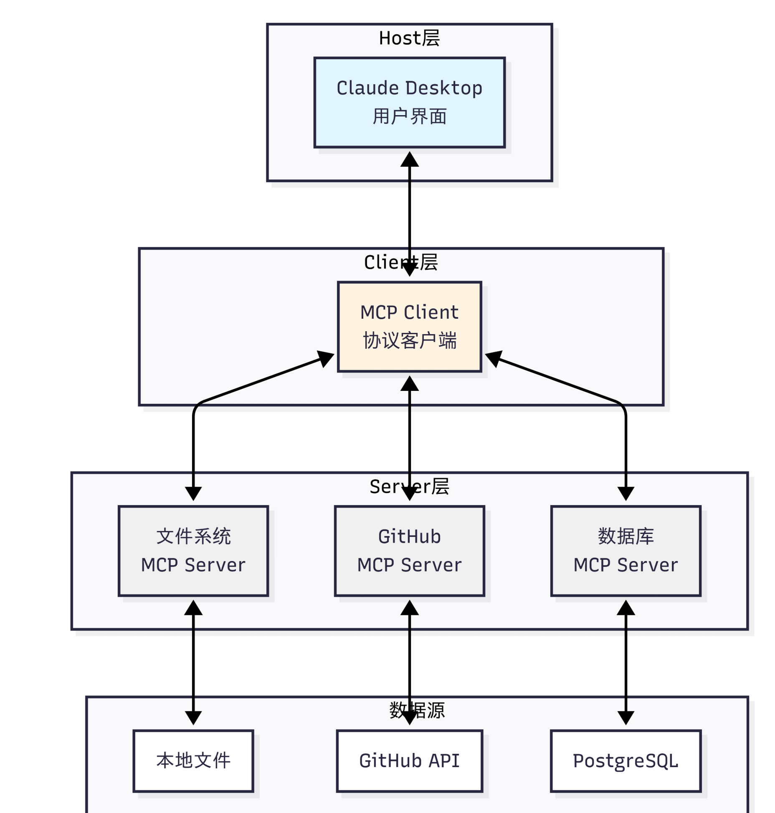
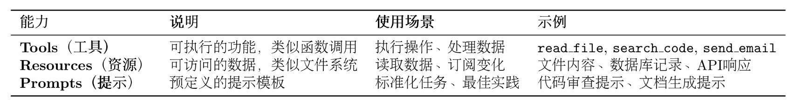
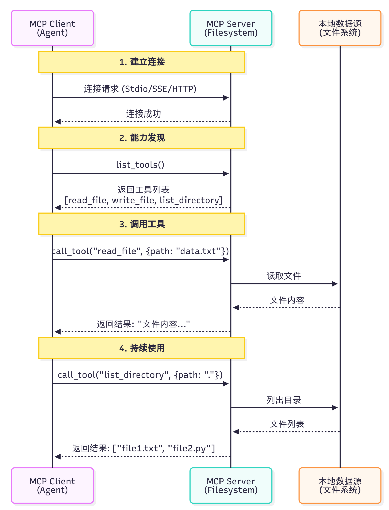
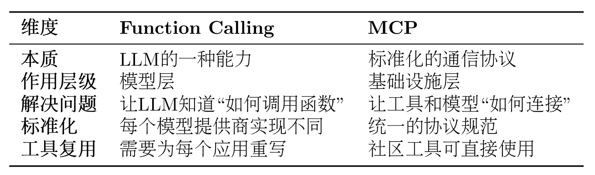
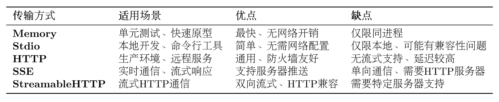

# MCP协议实战

现在，让我们深入学习 MCP，掌握如何让智能体访问外部工具和资源。

## MCP协议概念介绍

1. MCP：智能体的"USB-C"

想象一下，你的智能体可能需要同时做很多事情，例如：

读取本地文件系统的文档
查询 PostgreSQL 数据库
搜索 GitHub 上的代码
发送 Slack 消息
访问 Google Drive

传统方式下，你需要为每个服务编写适配器代码，处理不同的 API、认证方式、错误处理等。这不仅工作量大，而且难以维护。更重要的是，不同 LLM 平台的 function call 实现差异巨大，切换模型时需要重写大量代码。

MCP 的出现改变了这一切。它就像 USB-C 统一了各种设备的连接方式一样，MCP 统一了智能体与外部工具的交互方式。无论你使用 Claude、GPT 还是其他模型，只要它们支持 MCP 协议，就能无缝访问相同的工具和资源。

2. MCP 架构

MCP 协议采用 Host、Client、Servers 三层架构设计，让我们通过图片的场景来理解这些组件如何协同工作。

假设你正在使用 Claude Desktop 询问："我桌面上有哪些文档？":



*三层架构的职责*

    1. Host（宿主层）：Claude Desktop 作为 Host，负责接收用户提问并与 Claude 模型交互。Host 是用户直接交互的界面，它管理整个对话流程。

    2. Client（客户端层）：当 Claude 模型决定需要访问文件系统时，Host 中内置的 MCP Client 被激活。Client 负责与适当的 MCP Server 建立连接，发送请求并接收响应。

    3. Server（服务器层）：文件系统 MCP Server 被调用，执行实际的文件扫描操作，访问桌面目录，并返回找到的文档列表。

完整的交互流程：用户问题 → Claude Desktop(Host) → Claude 模型分析 → 需要文件信息 → MCP Client 连接 → 文件系统 MCP Server → 执行操作 → 返回结果 → Claude 生成回答 → 显示在 Claude Desktop 上

这种架构设计的优势在于关注点分离：Host 专注于用户体验，Client 专注于协议通信，Server 专注于具体功能实现。开发者只需专注于开发对应的 MCP Server，无需关心 Host 和 Client 的实现细节。

3. MCP的核心能力

如表所示，MCP 协议提供了三大核心能力，构成完整的工具访问框架：



这三种能力的区别在于：Tools 是主动的（执行操作），Resources 是被动的（提供数据），Prompts 是指导性的（提供模板）。

Example:

    1. Resources (资源) —— “像是给 AI 看的菜单或账本”
    关键词：被动、上下文、只读数据

    Resources 是 AI 获取信息的方式。它把数据“喂”给 AI，让 AI 知道现在的状况。

    场景： 你问 AI：“今天库存里还有多少牛肉？”

    MCP 运作： AI 不能凭空猜，它需要读取后台数据。服务器通过 Resources 接口，把 inventory/beef.txt 或者数据库里的实时库存数据发送给 AI。

    AI 的视角： “我‘看’到了一个数据文件，上面写着牛肉库存：5kg。”

    关键点： AI 只是读取（Read），它此时没有修改任何数据，也没有去进货。这就是“被动的数据提供”。

    2. Tools (工具) —— “像是给 AI 的厨具或电话”
    关键词：主动、执行、副作用 (Side Effects)

    Tools 是 AI 能够调用的函数或 API。这不仅仅是看，而是要改变世界（比如发消息、改数据、运行代码）。

    场景： 你看完库存后说：“牛肉不够了，帮我向供应商订 10kg 牛肉。”

    MCP 运作： AI 分析出你的意图，决定使用一个叫 order_ingredient 的工具。

    代码行为： AI 执行了函数 order_ingredient(item="beef", amount="10kg")。

    关键点： 这个操作改变了现实（供应商收到了订单，你的银行卡扣了款）。这就是“主动的执行”。

    3. Prompts (提示词/模板) —— “像是给 AI 的员工手册或SOP”
    关键词：引导、模板、标准化流程

    Prompts 是预先写好的指令模板，用来帮助用户或 AI 快速进入某种特定的工作状态。它不是数据，也不是功能，而是“对话的某种开场方式”。

    场景： 每天早上你需要 AI 帮你写一份“餐厅日报”。你不想每次都打字说：“请你扮演一个专业的餐厅经理，读取昨天的流水，总结利润，然后分析菜品销量……”

    MCP 运作： 开发者在 MCP 服务器里内置了一个叫 daily_report 的 Prompt。

    用户操作： 你在界面上点击“生成日报”按钮（其实就是选择了这个 Prompt）。

    效果： 输入框里自动填充了一大段设定好的指令：“你是一名资深数据分析师，请通过 Resource 读取昨天的销售记录，并按以下格式生成报告：1. 总收入... 2. 爆款菜品...”。

    关键点： 它就像一个快捷指令，把“如何使用工具”和“如何读取资源”的逻辑串联起来，告诉 AI 该怎么开始干活。

4. MCP的工作流程

用下面具体的例子来理解MCP的完整工作流程:



一个关键问题是：Claude（或其他 LLM）是如何决定使用哪些工具的？当用户提出问题时，完整的工具选择流程如下：

    - 工具发现阶段：MCP Client 连接到 Server 后，首先调用list_tools()获取所有可用工具的描述信息（包括工具名称、功能说明、参数定义）
    
    - 上下文构建：Client 将工具列表转换为 LLM 能理解的格式，添加到系统提示词中。例如：
        ```
        你可以使用以下工具：
        - read_file(path: str): 读取指定路径的文件内容
        - search_code(query: str, language: str): 在代码库中搜索
        ```

    - 模型推理：LLM 分析用户问题和可用工具，决定是否需要调用工具以及调用哪个工具。这个决策基于工具的描述和当前对话上下文

    - 工具执行：如果 LLM 决定使用工具，Client 通过 MCP Server 执行所选工具，获取结果
    
    - 结果整合：工具执行结果被送回给 LLM，LLM 结合结果生成最终回答

这个过程是完全自动化的，LLM 会根据工具描述的质量来决定是否使用以及如何使用工具。因此，编写清晰、准确的工具描述至关重要。

5. MCP 与 Function Calling 的差异

很多开发者会问：我已经在用 Function Calling 了，为什么还需要 MCP？ 让我们通过下表来理解它们的区别。



这里我们以智能体需要访问 GitHub 仓库和本地文件系统为例子来详细对比同一个任务的两种实现。

方式1: 使用Function Calling

```python
# 步骤1：为每个LLM提供商定义函数
# OpenAI格式
openai_tools = [
    {
        "type": "function",
        "function": {
            "name": "search_github",
            "description": "搜索GitHub仓库",
            "parameters": {
                "type": "object",
                "properties": {
                    "query": {"type": "string", "description": "搜索关键词"}
                },
                "required": ["query"]
            }
        }
    }
]

# Claude格式
claude_tools = [
    {
        "name": "search_github",
        "description": "搜索GitHub仓库",
        "input_schema": {  # 注意：不是parameters
            "type": "object",
            "properties": {
                "query": {"type": "string", "description": "搜索关键词"}
            },
            "required": ["query"]
        }
    }
]

# 步骤2：自己实现工具函数
def search_github(query):
    import requests
    response = requests.get(
        "https://api.github.com/search/repositories",
        params={"q": query}
    )
    return response.json()

# 步骤3：处理不同模型的响应格式
# OpenAI的响应
if response.choices[0].message.tool_calls:
    tool_call = response.choices[0].message.tool_calls[0]
    result = search_github(**json.loads(tool_call.function.arguments))

# Claude的响应
if response.content[0].type == "tool_use":
    tool_use = response.content[0]
    result = search_github(**tool_use.input)

```

方式2: 使用MCP

```python
from hello_agents.protocols import MCPClient

# 步骤1：连接到社区提供的MCP服务器（无需自己实现）
github_client = MCPClient([
    "npx", "-y", "@modelcontextprotocol/server-github"
])

fs_client = MCPClient([
    "npx", "-y", "@modelcontextprotocol/server-filesystem", "."
])

# 步骤2：统一的调用方式（与模型无关）
async with github_client:
    # 自动发现工具
    tools = await github_client.list_tools()

    # 调用工具（标准化接口）
    result = await github_client.call_tool(
        "search_repositories",
        {"query": "AI agents"}
    )

# 步骤3：任何支持MCP的模型都能使用
# OpenAI、Claude、Llama等都使用相同的MCP客户端

```

首先需要明确的是，Function Calling 与 MCP 并非竞争关系，而是相辅相成的。Function Calling 是大语言模型的一项核心能力，它体现了模型内在的智能，使模型能够理解何时需要调用函数，并精准生成相应的调用参数。相对地，MCP 则扮演着基础设施协议的角色，它在工程层面解决了工具与模型如何连接的问题，通过标准化的方式来描述和调用工具。

## 使用MCP客户端

Agents 基于 FastMCP 2.0 实现了完整的 MCP 客户端功能。我们提供了异步和同步两种 API，以适应不同的使用场景。对于大多数应用，推荐使用异步 API，它能更好地处理并发请求和长时间运行的操作。下面我们将提供一个拆解的操作演示。

1. 连接到MCP服务器

MCP 客户端支持多种连接方式，最常用的是 Stdio 模式（通过标准输入输出与本地进程通信）:

```python
import asyncio
from hello_agents.protocols import MCPClient

async def connect_to_server():
    # 方式1：连接到社区提供的文件系统服务器
    # npx会自动下载并运行@modelcontextprotocol/server-filesystem包
    client = MCPClient([
        "npx", "-y",
        "@modelcontextprotocol/server-filesystem",
        "."  # 指定根目录
    ])

    # 使用async with确保连接正确关闭
    async with client:
        # 在这里使用client
        tools = await client.list_tools()
        print(f"可用工具: {[t['name'] for t in tools]}")

    # 方式2：连接到自定义的Python MCP服务器
    client = MCPClient(["python", "my_mcp_server.py"])
    async with client:
        # 使用client...
        pass

# 运行异步函数
asyncio.run(connect_to_server())

```

其余内容详见: `MCP/connect_to_server.py`

完整示例:使用Github MCP服务:

```python
"""
GitHub MCP 服务示例

注意：需要设置环境变量
    Windows: $env:GITHUB_PERSONAL_ACCESS_TOKEN="your_token_here"
    Linux/macOS: export GITHUB_PERSONAL_ACCESS_TOKEN="your_token_here"
"""

from hello_agents.tools import MCPTool

# 创建 GitHub MCP 工具
github_tool = MCPTool(
    server_command=["npx", "-y", "@modelcontextprotocol/server-github"]
)

# 1. 列出可用工具
print("📋 可用工具：")
result = github_tool.run({"action": "list_tools"})
print(result)

# 2. 搜索仓库
print("\n🔍 搜索仓库：")
result = github_tool.run({
    "action": "call_tool",
    "tool_name": "search_repositories",
    "arguments": {
        "query": "AI agents language:python",
        "page": 1,
        "perPage": 3
    }
})
print(result)
```

## MCP传输方式详解

MCP 协议的一个重要特性是传输层无关性（Transport Agnostic）。这意味着 MCP 协议本身不依赖于特定的传输方式，可以在不同的通信通道上运行。本项目基于 FastMCP 2.0，提供了完整的传输方式支持，让你可以根据实际场景选择最合适的传输模式。

1. 传输方式概览

HelloAgents 的MCPClient支持五种传输方式，每种都有不同的使用场景，如表所示：



2. 传输方式使用事例

```python
from hello_agents.tools import MCPTool

# 1. Memory Transport - 内存传输（用于测试）
# 不指定任何参数，使用内置演示服务器
mcp_tool = MCPTool()

# 2. Stdio Transport - 标准输入输出传输（本地开发）
# 使用命令列表启动本地服务器
mcp_tool = MCPTool(server_command=["python", "examples/mcp_example_server.py"])

# 3. Stdio Transport with Args - 带参数的命令传输
# 可以传递额外参数
mcp_tool = MCPTool(server_command=["python", "examples/mcp_example_server.py", "--debug"])

# 4. Stdio Transport - 社区服务器（npx方式）
# 使用npx启动社区MCP服务器
mcp_tool = MCPTool(server_command=["npx", "-y", "@modelcontextprotocol/server-filesystem", "."])

# 5. HTTP/SSE/StreamableHTTP Transport
# 注意：MCPTool主要用于Stdio和Memory传输
# 对于HTTP/SSE等远程传输，建议直接使用MCPClient

```

3. 内存传输-Memory Transport

适用场景：单元测试、快速原型开发

```python
from hello_agents.tools import MCPTool

# 使用内置演示服务器（Memory传输）
mcp_tool = MCPTool()

# 列出可用工具
result = mcp_tool.run({"action": "list_tools"})
print(result)

# 调用工具
result = mcp_tool.run({
    "action": "call_tool",
    "tool_name": "add",
    "arguments": {"a": 10, "b": 20}
})
print(result)

```

4. Stdio Transport - 标准输入输出传输

适用场景：本地开发、调试、Python 脚本服务器

```python
from hello_agents.tools import MCPTool

# 方式1：使用自定义Python服务器
mcp_tool = MCPTool(server_command=["python", "my_mcp_server.py"])

# 方式2：使用社区服务器（文件系统）
mcp_tool = MCPTool(server_command=["npx", "-y", "@modelcontextprotocol/server-filesystem", "."])

# 列出工具
result = mcp_tool.run({"action": "list_tools"})
print(result)

# 调用工具
result = mcp_tool.run({
    "action": "call_tool",
    "tool_name": "read_file",
    "arguments": {"path": "README.md"}
})
print(result)

```

5. HTTP Transport - HTTP 传输

适用场景：生产环境、远程服务、微服务架构

注意：MCPTool 主要用于 Stdio 和 Memory 传输
      对于 HTTP/SSE 等远程传输，建议使用底层的 MCPClient

```python
import asyncio
from hello_agents.protocols import MCPClient

async def test_http_transport():
    # 连接到远程 HTTP MCP 服务器
    client = MCPClient("http://api.example.com/mcp")

    async with client:
        # 获取服务器信息
        tools = await client.list_tools()
        print(f"远程服务器工具: {len(tools)} 个")

        # 调用远程工具
        result = await client.call_tool("process_data", {
            "data": "Hello, World!",
            "operation": "uppercase"
        })
        print(f"远程处理结果: {result}")

# 注意：需要实际的 HTTP MCP 服务器
# asyncio.run(test_http_transport())
```

6. SSE Transport - Server-Sent Events 传输

适用场景：实时通信、流式处理、长连接

```python
# 注意：MCPTool 主要用于 Stdio 和 Memory 传输
# 对于 SSE 传输，建议使用底层的 MCPClient

import asyncio
from hello_agents.protocols import MCPClient

async def test_sse_transport():
    # 连接到 SSE MCP 服务器
    client = MCPClient(
        "http://localhost:8080/sse",
        transport_type="sse"
    )

    async with client:
        # SSE 特别适合流式处理
        result = await client.call_tool("stream_process", {
            "input": "大量数据处理请求",
            "stream": True
        })
        print(f"流式处理结果: {result}")

# 注意：需要支持 SSE 的 MCP 服务器
# asyncio.run(test_sse_transport())

```

## 在智能体中使用MCP工具

前面我们学习了如何直接使用 MCP 客户端。但在实际应用中，我们更希望让智能体自动调用 MCP 工具，而不是手动编写调用代码。HelloAgents 提供了MCPTool包装器，让 MCP 服务器无缝集成到智能体的工具链中。

1. MCP 工具的自动展开机制

HelloAgents 的MCPTool有一个特性：自动展开。当你添加一个 MCP 工具到 Agent 时，它会自动将 MCP 服务器提供的所有工具展开为独立的工具，让 Agent 可以像调用普通工具一样调用它们。

方式 1：使用内置演示服务器

我们在之前实现过计算器的工具函数，在这里将他转化为 MCP 的服务。这是最简单的使用方式。详见`MCP/code/built_in_connect.py`

方式 2：连接外部 MCP 服务器

在实际项目中，你需要连接到功能更强大的 MCP 服务器。这些服务器可以是：
    - 社区提供的官方服务器（如文件系统、GitHub、数据库等）
    - 你自己编写的自定义服务器（封装业务逻辑）

详见`MCP/code/external_server.py`

### 实战案例：智能文档助手


