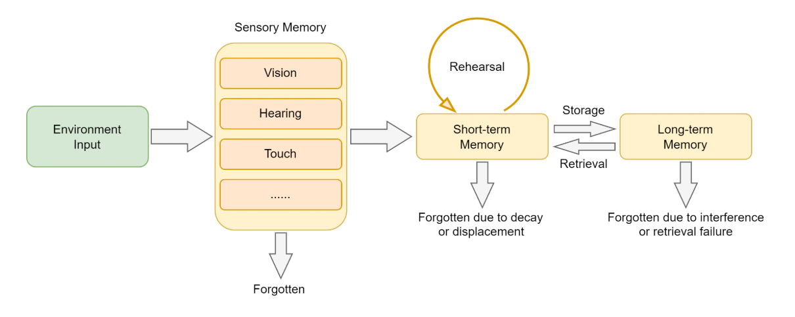
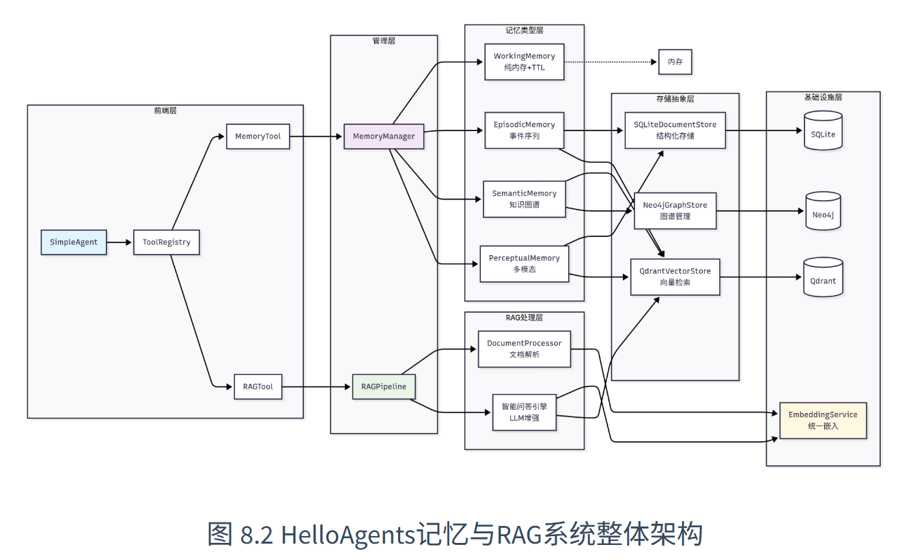

# 记忆与检索

## 从认知科学到智能体记忆

### 人类记忆系统的启发

在构建智能体的记忆系统之前，让我们先从认知科学的角度理解人类是如何处理和存储信息的。人类记忆是一个多层级的认知系统，它不仅能存储信息，还能根据重要性、时间和上下文对信息进行分类和整理。认知心理学为理解记忆的结构和过程提供了经典的理论框架。



根据认知心理学的研究，人类记忆可以分为以下几个层次：

- **感觉记忆（Sensory Memory）**：持续时间极短（0.5-3秒），容量巨大，负责暂时保存感官接收到的所有信息

- **工作记忆（Working Memory）**：持续时间短（15-30秒），容量有限（7±2个项目），负责当前任务的信息处理

- **长期记忆（Long-term Memory）**：持续时间长（可达终生），容量几乎无限，进一步分为：
  - **程序性记忆**：技能和习惯（如骑自行车）
  - **陈述性记忆**：可以用语言表达的知识，又分为：
    - **语义记忆**：一般知识和概念（如"巴黎是法国首都"）
    - **情景记忆**：个人经历和事件（如"昨天的会议内容"）

### 为何智能体需要记忆与 RAG

借鉴人类记忆系统的设计，我们可以理解为什么智能体也需要类似的记忆能力。人类智能的一个重要特征就是能够记住过去的经历，从中学习，并将这些经验应用到新的情况中。同样，一个真正智能的智能体也需要具备记忆能力。

对于基于 LLM 的智能体而言，通常面临两个根本性局限：**对话状态的遗忘**和**内置知识的局限**。

#### 1. 局限一：无状态导致的对话遗忘

当前的大语言模型虽然强大，但设计上是无状态的。这意味着，每一次用户请求（或 API 调用）都是一次独立的、无关联的计算。模型本身不会自动"记住"上一次对话的内容。这带来了几个问题：

- **上下文丢失**：在长对话中，早期的重要信息可能会因为上下文窗口限制而丢失
- **个性化缺失**：Agent 无法记住用户的偏好、习惯或特定需求
- **学习能力受限**：无法从过往的成功或失败经验中学习改进
- **一致性问题**：在多轮对话中可能出现前后矛盾的回答

要解决这个问题，我们的框架需要引入记忆系统。

#### 2. 局限二：模型内置知识的局限性

除了遗忘对话历史，LLM 的另一个核心局限在于其知识是静态的、有限的。这些知识完全来自于它的训练数据，并因此带来一系列问题：

- **知识时效性**：大模型的训练数据有时间截止点，无法获取最新信息
- **专业领域知识**：通用模型在特定领域的深度知识可能不足
- **事实准确性**：通过检索验证，减少模型的幻觉问题
- **可解释性**：提供信息来源，增强回答的可信度

为了克服这一局限，**RAG（Retrieval-Augmented Generation）技术**应运而生。它的核心思想是在模型生成回答之前，先从一个外部知识库（如文档、数据库、API）中检索出最相关的信息，并将这些信息作为上下文一同提供给模型。

### 记忆与 RAG 系统架构设计

我们设计了一个分层的记忆与 RAG 系统架构，如下图所示：



这个架构不仅借鉴了人类记忆系统的层次结构，还充分考虑了工程实现的可扩展性。在实现上，我们将记忆和 RAG 设计为两个独立的工具：

- **`memory_tool`**：负责存储和维护对话过程中的交互信息
- **`rag_tool`**：负责从用户提供的知识库中检索相关信息作为上下文，并可将重要的检索结果自动存储到记忆系统中

#### 记忆系统架构

记忆系统采用了四层架构设计：

```
HelloAgents记忆系统
├── 基础设施层 (Infrastructure Layer)
│   ├── MemoryManager - 记忆管理器（统一调度和协调）
│   ├── MemoryItem - 记忆数据结构（标准化记忆项）
│   ├── MemoryConfig - 配置管理（系统参数设置）
│   └── BaseMemory - 记忆基类（通用接口定义）
├── 记忆类型层 (Memory Types Layer)
│   ├── WorkingMemory - 工作记忆（临时信息，TTL管理）
│   ├── EpisodicMemory - 情景记忆（具体事件，时间序列）
│   ├── SemanticMemory - 语义记忆（抽象知识，图谱关系）
│   └── PerceptualMemory - 感知记忆（多模态数据）
├── 存储后端层 (Storage Backend Layer)
│   ├── QdrantVectorStore - 向量存储（高性能语义检索）
│   ├── Neo4jGraphStore - 图存储（知识图谱管理）
│   └── SQLiteDocumentStore - 文档存储（结构化持久化）
└── 嵌入服务层 (Embedding Service Layer)
    ├── DashScopeEmbedding - 通义千问嵌入（云端API）
    ├── LocalTransformerEmbedding - 本地嵌入（离线部署）
    └── TFIDFEmbedding - TFIDF嵌入（轻量级兜底）
```

#### RAG 系统架构

RAG 系统专注于外部知识的获取和利用：

```
HelloAgents RAG系统
├── 文档处理层 (Document Processing Layer)
│   ├── DocumentProcessor - 文档处理器（多格式解析）
│   ├── Document - 文档对象（元数据管理）
│   └── Pipeline - RAG管道（端到端处理）
├── 嵌入表示层 (Embedding Layer)
│   └── 统一嵌入接口 - 复用记忆系统的嵌入服务
├── 向量存储层 (Vector Storage Layer)
│   └── QdrantVectorStore - 向量数据库（命名空间隔离）
└── 智能问答层 (Intelligent Q&A Layer)
    ├── 多策略检索 - 向量检索 + MQE + HyDE
    ├── 上下文构建 - 智能片段合并与截断
    └── LLM增强生成 - 基于上下文的准确问答
```